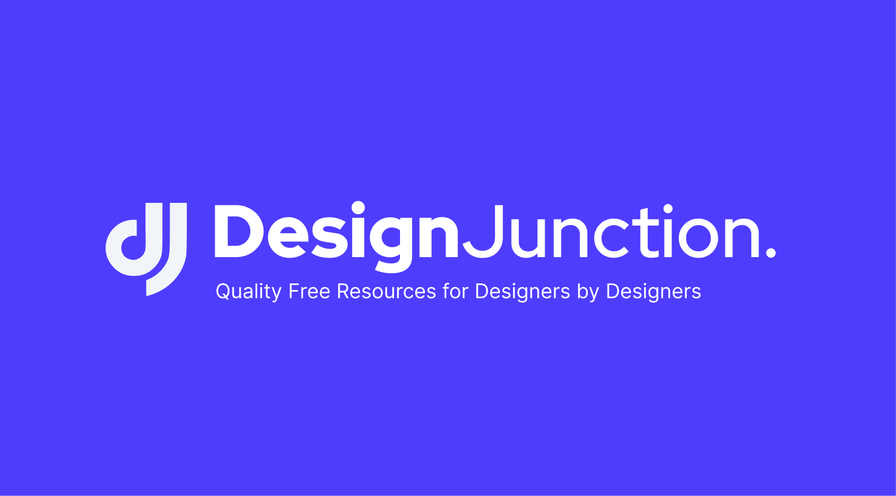

Design Junction

Design Junction is a one-stop resource library for Designers and Creatives with curated list of best resources handpicked from around the web.

 

## **Quirks** ✨

- 📚 70+ Resources
- 💰 Free Forever
- 🔓 No signup Needed
- 🌟 Updated Weekly

 

## **Contribute to the Project** ✨

- Help us to keep the project alive at https://ko-fi.com/exwhyzee
- [Suggest or promote a resource](https://docs.google.com/forms/d/e/1FAIpQLSec-SOfIEdxqJSQsFQwI0DBH1pbMl4xNdgWlJs7pbVV4tnM7A/viewform)
- Pull requests are welcome 🤍

  

Made with 🤍 by [exwhyzee](https://twitter.com/exxyzee), [Sap](https://twitter.com/imsaptarshiii), [Denin](https://twitter.com/deninpaul_)
